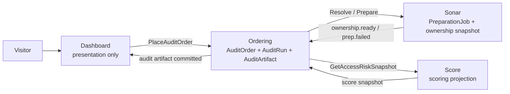

# Architectural overview

## 1. Product truth

The product is not a PDF, page, or chart. It is a versioned **access-risk data artifact** that can be rendered later in any presentation.

### Input

```yaml
chain: string
contract_address: string
snapshot_at: ISO-8601 timestamp or null
optional_gating_rule: object or null
```

### Output

```yaml
artifact_schema: access-risk-audit.v1
holder_turnover: structured metric
sold_or_lapsed_wallet_count: integer
newly_eligible_wallet_count: integer
concentration_notes: structured notes
stale_access_risk_estimate: structured estimate
source_snapshots:
  sonar: provenance reference
  score: provenance reference
cta:
  kind: shadow_access_audit
```

The artifact stores data and provenance, not a fixed presentation.

## 2. Minimal active architecture



### Why Ordering owns the artifact initially

The audit engine is a logical module inside Ordering for the MVP. This avoids a new service while still making the `AuditRun` and `AuditArtifact` explicit actors/nouns. Extract only after independent scaling, security, release cadence, or reuse is proven.

## 3. Three product actors

### AuditOrder

Identity: `audit_id`

Owns:
- canonical request inputs;
- public lifecycle status;
- references to preparation, Score snapshot, and artifact;
- failure reason.

### PreparationJob

Identity: Sonar `physical_job_id`

Owns:
- indexing/preparation lifecycle;
- ownership readiness evidence;
- preparation failure.

### AuditRun

Identity: `run_id`

Owns:
- exact Sonar and Score input snapshot references;
- computation status;
- generated artifact and provenance.

`AuditArtifact` is the immutable result of a produced AuditRun. It is not a UI shape.

## 4. State flow

```text
AuditOrder:
requested -> resolving -> preparing -> analyzing -> ready
                                      \-> needs_attention

PreparationJob:
queued -> indexing -> completed
                  \-> failed

AuditRun:
queued -> collecting -> computing -> produced
                                \-> failed
```

The public UI projection is:

```text
requested | preparing | analyzing | ready | needs_attention
```

Internal states are not exposed directly.

## 5. Collection resolution

The MVP input already includes chain + contract address, so resolution is initially a synchronous canonicalization/capability query, not a durable actor.

A durable `CollectionResolution` actor is earned only when the system accepts ambiguous names, URLs, multiple deployments, or user selection that must survive sessions.

Demand observability comes from the durable AuditOrder row and metrics—not shared-work or capacity machinery.

## 6. Score boundary

The report requires Score-derived information, but report generation and Score catalog admission are different lanes.

Allowed:

```text
Ordering -> Score query/compute snapshot -> AuditRun
```

Forbidden:

```text
Sonar ownership.ready -> Score status active
AuditOrder progress -> Registry Scoring
```

Authorized humans and agents may issue an explicit Score catalog command. That command must record actor identity, reason, input evidence, and an audit receipt. It is not part of report fulfillment.

The current exact Score capability that produces `access-risk-snapshot.v1` is an unresolved interface question and must be verified rather than invented.

## 7. Shadow Access Audit lane

The public report ends with a CTA to compare current onchain eligibility against Discord role assignments.

This lane requires:

```text
ready access-risk artifact
+ authorized Discord role snapshot
-> shadow access audit data
```

It is post-value and optional. It should not block the anonymous report.

The current owner/runtime of Discord role snapshots is unverified in the supplied census and remains an explicit gap.

## 8. Account and community onboarding

After value is delivered, a visitor may:

1. create/link an Identity account;
2. create or claim a community;
3. attach the report to the community;
4. later invite other members.

Identity owns the user account. Score may own community scoring/catalog state. Ordering may retain the report reference. The owner of community membership and invitations is not yet ratified; this blueprint refuses to invent it.

## 9. Transport

The MVP uses one active path:

```text
HTTP commands and queries
+ Postgres transactions
+ idempotency
+ polling
```

NATS/JetStream remains deferred until at least one of these is true:

- a second live consumer needs the same fact;
- producer and consumer must be independently available;
- replay/fan-out is materially required;
- a named operator owns the broker.

## 10. What to hide from the default mental model

Reliability mechanisms may remain in code but should not appear as product actors by default:

- outbox delivery states;
- shared preparation generations;
- admission capacity reservations;
- collection-resolution CAS machinery;
- retries, leases, and reconciliation cursors.

They become visible only in an operator/debug view.

## 11. Immediate simplification hypotheses

These are research/decision candidates, not deletion authorization:

- hide or disable shared-preparation/capacity machinery for the single-order MVP unless a real concurrency constraint is demonstrated;
- remove Dashboard process-local order/access stubs from production paths;
- keep Worlds outside the report path;
- treat Score as a read/compute dependency for the report, not a catalog mutation step;
- use the AuditOrder table for demand observability;
- keep the audit engine co-located with Ordering.
