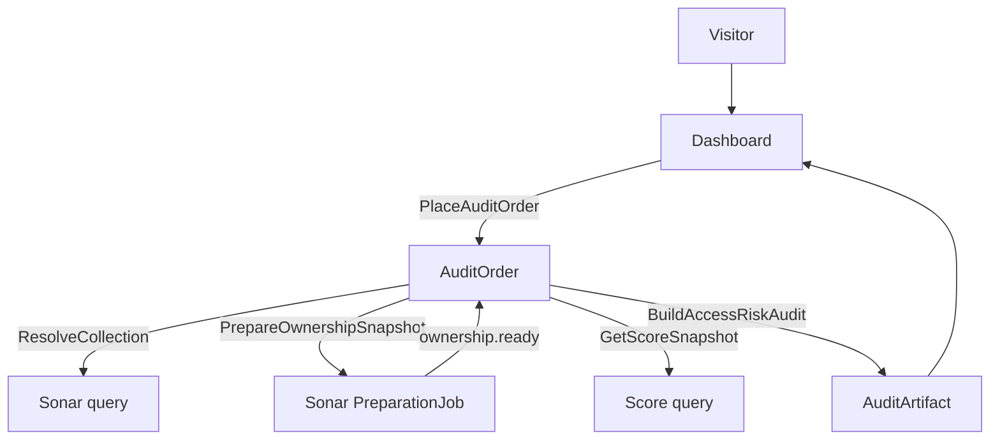
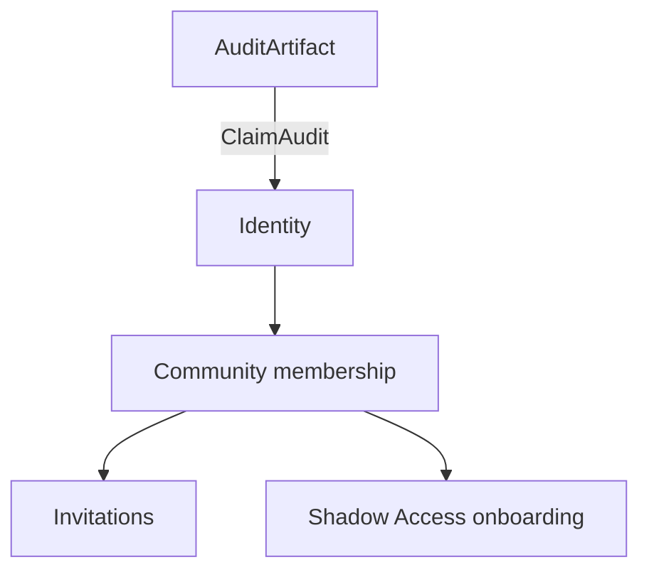
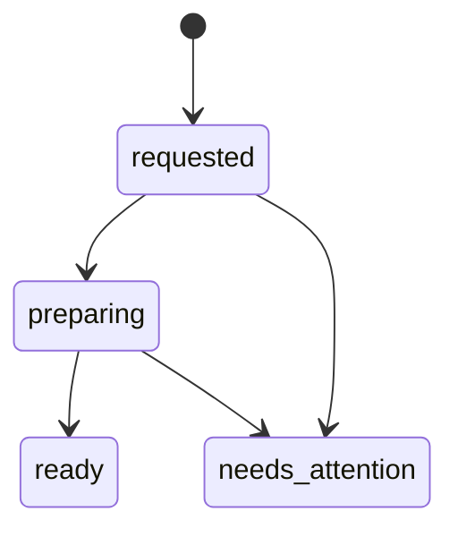
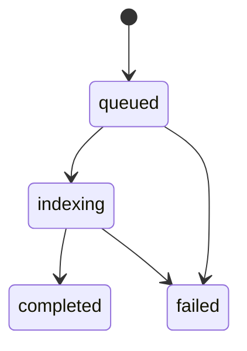

# Freeside Active System

Operator map only. Product repositories remain executable truth. This file has no runtime.

## Product

A visitor submits a chain-qualified contract, receives an honest preparation status, and gets a Contract Access-Risk Audit without authenticating first.

Inputs:

- chain
- contract address
- snapshot/reference date
- optional gating rule

Outputs (immutable artifact data, presentation-neutral):

- holder turnover
- sold/lapsed wallet count
- newly eligible wallet count
- whale/concentration notes
- stale-access risk estimate
- CTA to map results to Discord roles through Shadow Access Audit (post-value; does not block the anonymous report)

## Active path



```text
Visitor
→ Dashboard
→ Ordering creates AuditOrder
→ Sonar resolves and prepares ownership data
→ Ordering reads Sonar snapshot
→ Ordering reads Score snapshot
→ Ordering builds and stores AuditArtifact
→ Dashboard reads AuditArtifact
```

### After value (optional lane)



```text
AuditArtifact
→ Identity account
→ Community membership (Identity)
→ invitations and Shadow Access onboarding
```

Worlds is not required. NATS is not required. A report microservice is not required. MCP is not required.

## Owners

| Noun | Sole owner |
|---|---|
| AuditOrder | Ordering |
| PreparationJob | Sonar |
| Ownership snapshot | Sonar |
| Score snapshot | Score |
| AuditArtifact | Ordering |
| User identity | Identity |
| Community membership | Identity |
| Presentation | Dashboard |

Dashboard owns no backend truth.

## Capabilities

| Capability | Owner | Input | Output |
|---|---|---|---|
| ResolveCollection | Sonar | chain + address | canonical subject |
| PrepareOwnershipSnapshot | Sonar | canonical subject + date | ownership snapshot |
| GetScoreSnapshot | Score | canonical subject + date | scoring snapshot |
| BuildAccessRiskAudit | Ordering | Sonar + Score snapshots | audit data |
| SaveAuditArtifact | Ordering | audit data | artifact_id |
| ClaimAudit | Identity | artifact_id + verified user | saved community audit |

A capability does not automatically deserve a repository, service, database, queue, actor, or MCP server. Start as a function or module inside the correct owner.

## State

Only long-lived product machines for the MVP:

### AuditOrder (Ordering)



```text
requested → preparing → ready
requested | preparing → needs_attention
```

Stores: order_id, chain, contract address, snapshot/reference date, optional gating rule, status, artifact_id when ready, failure reason when blocked.

### PreparationJob (Sonar)



```text
queued → indexing → completed
queued | indexing → failed
```

No AuditRun actor yet. Audit calculation is initially:

```text
Sonar snapshot + Score snapshot → pure audit function → immutable AuditArtifact
```

Add AuditRun only if generation becomes slow, asynchronous, retryable, or independently scalable.

### Public projection (Dashboard)

```text
requested | preparing | ready | needs_attention
```

Projections are views over upstream facts. Dashboard does not create readiness, Score state, or order completion.

## Commands, queries, facts

| Kind | Example | Rule |
|---|---|---|
| Command | PrepareCollection / PlaceAuditOrder | May be rejected |
| Query | GetScoreSnapshot | Changes nothing |
| Fact | ownership.ready | Already committed |

Forbidden: Sonar readiness silently activating Score catalog state. Each owner decides what it is permitted to do from facts and its own commands.

## Proofs

| Step | Required proof |
|---|---|
| Request accepted | order_id |
| Order durable | AuditOrder row |
| Subject resolved | canonical subject reference |
| Sonar ready | ownership snapshot reference |
| Score ready | scoring snapshot reference |
| Audit built | immutable AuditArtifact |
| User saw result | Dashboard successfully fetched artifact |

Not one generic `{ "success": true }`.

## Never

- Dashboard never owns upstream state.
- Sonar readiness never activates Score catalog state.
- Order status never becomes Registry Scoring.
- No authentication is required before requesting the audit.
- No new service is created for report generation initially.
- No broker is required for the MVP.
- No production in-memory fallback.
- No second active path for the same capability.
- Shadow Access / Discord role work never blocks the anonymous first report.

## Parked

- Worlds
- Score catalog admission
- NATS / JetStream fan-out
- shared preparation deduplication
- admission capacity reservation
- durable CollectionResolution actor (start as Sonar query; earn durability only if ambiguity/resume requires it)
- AuditRun actor
- report rendering formats
- full Discord role mutation
- paid access

## Branch budget

```text
active product paths:        1
durable product machines:    2
public states:               4
artifact owner:              1
transport per seam:          1
production fallbacks:        0
```

Remove: real-vs-stub dual paths, dual transports for the same action, in-memory vs Postgres in production, legacy vs new scoring with no owner, unused flags, reserved states with no producer/consumer.

## How to build from this

1. Choose one missing capability (recommended first: `GetScoreSnapshot` / Score).
2. Identify its sole owner.
3. Inspect only that repository at its exact commit.
4. Classify: EXISTS / PARTIAL / MISSING / WRONG OWNER.
5. Implement the smallest missing behavior in the owner.
6. Require one concrete proof (fixture → real call → typed result).
7. Delete scaffolding (stubs, alternate paths, obsolete terms).

Trust layers (distinct):

```text
SYSTEM.md          — what should be true
source repository  — what is implemented
one golden-path product test (in a product repo, later)
                   — one real request becomes one real artifact
```

## Agent contract

Read this file first. Implement or review exactly one capability from the Capabilities table.

1. Respect the named sole owner.
2. Do not create a new service, database, queue, actor, fallback, framework, or source of truth.
3. Inspect the owner repository at its current exact commit.
4. Report: what exists; what is missing; smallest change; what to delete afterward; concrete proof.
5. Do not change any item under Never.
6. If the requested behavior conflicts with this file, stop and ask for an operator decision.
7. Hard-block: do not edit product or agent code while in conflict with Owners, Never, or Active path.

No architecture compiler. This Markdown is the context.
