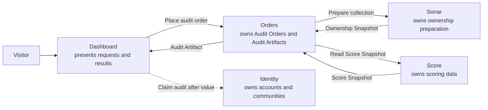
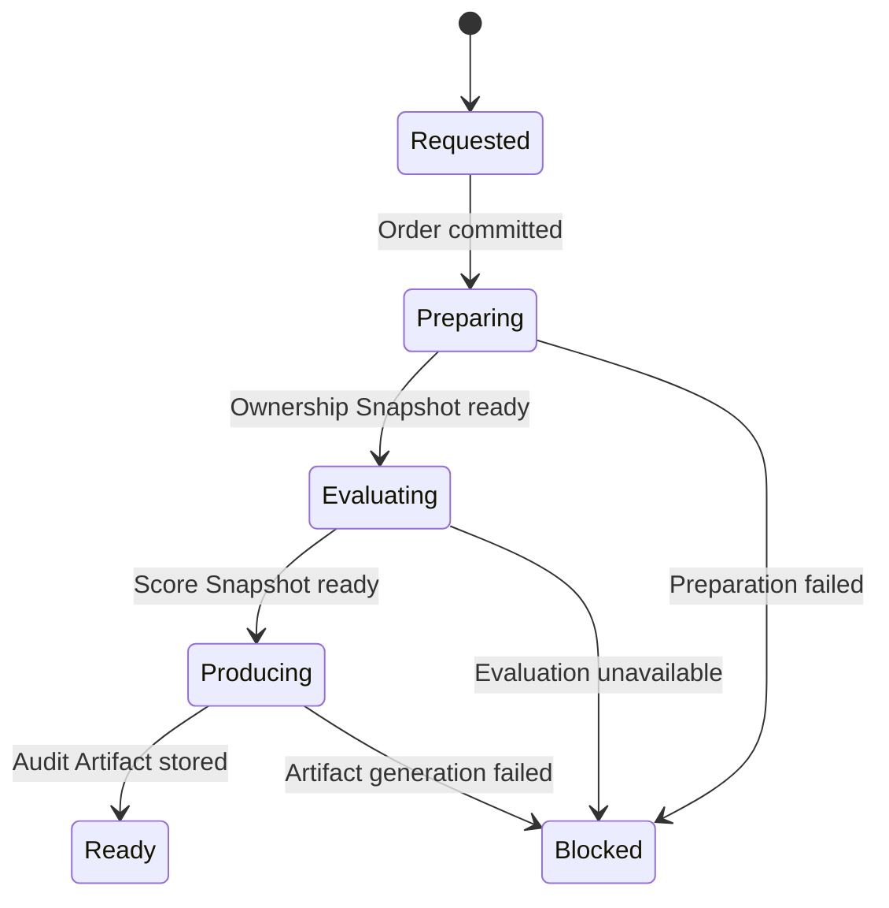

# Freeside Active System

Operator map for one journey. Production repos and live probes remain runtime authority. Intent and observation never merge silently.

## Product

A visitor submits a chain-qualified contract, sees honest progress, and receives a Contract Access-Risk Audit without authenticating first. The result is a versioned data artifact; presentation can change later.

Inputs: chain, contract address, snapshot/reference date, optional gating rule.

Outputs: holder turnover, sold/lapsed wallet count, newly eligible wallet count, whale/concentration notes, stale-access risk estimate, CTA to map results to Discord roles via no-install Shadow Access Audit.

## One active system



```text
Visitor → Dashboard → Orders → Sonar → Score → Orders → Dashboard
```

Identity onboarding is after value. Worlds, brokers, MCP, and a report microservice are not on this path.

## Candidate product projection

Conceptual product object only — not a committed API contract.

```json
{
  "id": "audit_...",
  "subject": {
    "chainId": 1,
    "contractAddress": "0x..."
  },
  "status": "preparing",
  "currentOwner": "Sonar",
  "preparation": {
    "status": "indexing",
    "jobId": "ingest_..."
  },
  "scoreSnapshot": null,
  "artifact": null,
  "proof": {},
  "blocker": null,
  "nextAction": "wait_for_preparation"
}
```

## Owners

| Noun | Sole owner |
|---|---|
| Audit Order | Orders |
| Preparation Job | Sonar |
| Ownership Snapshot | Sonar |
| Score Snapshot | Score |
| Audit Artifact | Orders |
| User identity | Identity |
| Presentation | Dashboard |

## Expected journey



Stages: Requested → Preparing → Evaluating → Producing → Ready | Blocked.

## Proofs

| Checkpoint | Owner | Evidence expected |
|---|---|---|
| Request accepted | Dashboard / Orders | accepted request id |
| Order committed | Orders | durable Audit Order |
| Subject resolved | Sonar | canonical subject |
| Ownership Snapshot ready | Sonar | ownership.ready + holder evidence |
| Score Snapshot ready | Score | versioned Score Snapshot without catalog admission |
| Audit Artifact stored | Orders | immutable Audit Artifact id |
| Artifact observed | Dashboard | successful artifact read |

## Finding classifications

| Class | Meaning |
|---|---|
| EXPECTED_WAIT | Existing system progressing normally |
| INPUT_ERROR | Request invalid or ambiguous |
| UPSTREAM_FAILURE | Expected capability failed |
| MISSING_CAPABILITY | Expected operation does not exist |
| BOUNDARY_VIOLATION | Only available operation requires unauthorized side effect |
| INCONSISTENT_STATE | Authoritative owners disagree |

Intent vs observation labels when they differ: MATCH, DOC_DRIFT, CODE_DEBT, MISSING_CAPABILITY, BOUNDARY_VIOLATION, OPERATOR_DECISION.

## Current blocker

```text
Current first unexpected state:
Score cannot evaluate an ownership-ready subject without catalog registration.

Classification:
MISSING_CAPABILITY

Owner:
Score

Subject:
eip155:1:0x902d94ba5bfc0cb408d1a6ca4b8f255d845e50e9

Sonar (observed):
ownership_ready=true; holders=2947;
job=ingest_8782378e4d8efdc03716488212ee7552_8153d3ff68e8a8e4

Score (observed):
GET /v1/communities/lookup → 404 NOT_REGISTERED
(register is not an equivalent path)

Tracking:
https://github.com/0xHoneyJar/score-api/issues/570

Required capability:
Read-only, non-admitting subject evaluation.

Forbidden workaround:
Registering the community solely to unblock the audit.

Work ledger:
./work.sh next  →  score-non-admitting-evaluation-001
```

## Work ledger

Append-only task receipts live in `work.jsonl`. Drive them with `./work.sh`. Four states only: queued → running → blocked | done (blocked → running allowed). Probe evidence belongs in event `proof` fields. Ledger state is not product truth.

## Never

- Dashboard never owns upstream state.
- Sonar readiness never activates Score catalog state.
- Audit requests never silently register communities.
- Orders owns the Audit Order and Audit Artifact.
- Score owns scoring data.
- One capability has one active path.
- No production in-memory fallback.
- No new service for audit generation initially.
- No broker is required for the MVP.

## Parked

Worlds · NATS / JetStream · MCP federation · generic sync engine · local-first replication · rendering formats · Discord role mutation · shared preparation deduplication · capacity reservation · paid access.

Parked means removed from the active mental model, not permanently rejected.
